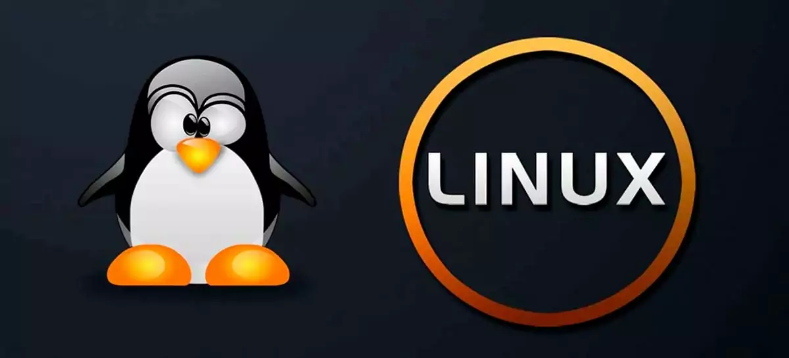

<h1> O quê esse Linux têm?</h1>

  

Toda a infraestrutura digital — de servidores na nuvem à internet das coisas — roda nele. 
Sua natureza de código aberto, alto desempenho e controle total via terminal o tornam a base insubstituível para ferramentas de segurança e defesa de redes

> E tem mais,viu!

As principais razões que explicam essa importância incluem:
Domínio da Infraestrutura: A grande maioria dos servidores web, bancos de dados e ambientes de nuvem (como AWS e Azure) utiliza sistemas Linux. Para proteger qualquer sistema, o profissional precisa entender como o ambiente Linux funciona.
Controle e Customização: Por ser código aberto, o Linux permite que especialistas alterem o kernel (núcleo) do sistema para maximizar a segurança, removendo serviços desnecessários e ajustando o uso de memória para evitar brechas.
Padrão para Ferramentas de Segurança: As principais soluções de cibersegurança e hacking ético (como firewalls, sistemas de detecção de intrusão e distribuições especializadas como o Kali Linux) são nativas ou desenvolvidas exclusivamente para Linux.
Poder da Linha de Comando: O terminal do Linux permite automatizar tarefas repetitivas, auditar logs do sistema e investigar ameaças com grande velocidade e eficiência, algo essencial na análise forense digital

<h1>O ambiente Linux </h1>
É um ecossistema de software de código aberto baseado em um sistema operacional central chamado kernel Linux. Ele é conhecido por sua estabilidade, segurança e por ser totalmente personalizável. 

Diferente de sistemas como Windows e macOS, que possuem um visual e funcionamento únicos controlados por uma única empresa, o "ambiente" no Linux varia de acordo com a sua escolha:
O Motor (Kernel): É o coração do sistema, responsável por gerenciar o processador, a memória e a comunicação entre o hardware e os programas.
As Distribuições (Distribs): Como o código do Linux é aberto, empresas e comunidades criam pacotes completos do sistema (as "distribuições") que reúnem o kernel com diferentes programas e ferramentas. As mais conhecidas são Ubuntu, Fedora e Linux Mint.
Ambiente Gráfico (Desktop Environment): É a interface com a qual você interage visualmente (janelas, barra de tarefas, ícones). Você pode escolher ambientes diferentes para o seu computador, como o GNOME, KDE Plasma ou XFCE, cada um com um visual e consumo de recursos diferentes.
Linha de Comando (Terminal/Shell): Para muitos profissionais, o ambiente Linux é sinônimo de terminal. Ele permite controlar todo o sistema usando comandos de texto, o que facilita automações e tarefas avançadas. 

Por que ele é tão utilizado?
Gratuito e Aberto: O sistema é livre para uso e seu código-fonte pode ser estudado e modificado por qualquer pessoa.
Onipresente: Ele não está só em computadores. A maior parte da internet, servidores em nuvem, supercomputadores, smart TVs, roteadores e até o sistema Android dos celulares rodam sobre o ambiente Linux.
Segurança: Devido à sua estrutura de permissões e a grande comunidade que audita o código, ele é amplamente adotado em servidores corporativos e infraestruturas de tecnologia da informação 
 

>⚠️As ferramentas contidas no Kali Linux são extremamente potentes e devem ser operadas exclusivamente de maneira ética, legal e com autorização formal. O uso indevido contra redes ou sistemas de terceiros é considerado crime cibernético.

<h1>Kali Linux</h1>

Segurança Ofensiva Proativa: Ele permite que hackers éticos (white hats) e Red Teams ajam como invasores. Ao simular ataques reais, é possível encontrar e corrigir falhas de segurança em redes e sistemas antes que criminosos as explorem. 

Ferramentas Pré-instaladas: O sistema elimina a necessidade de instalar e configurar programas de segurança manualmente. Ele já inclui recursos renomados para mapeamento de redes (Nmap), varredura web (Burp Suite), exploração de vulnerabilidades (Metasploit) e análise de tráfego (Wireshark). 

Foco em Ambientes de Teste: O sistema é otimizado para tarefas de auditoria, e suas configurações são voltadas para facilitar a execução de comandos complexos e testes de penetração. 

Versatilidade e Portabilidade: O Kali pode ser rodado diretamente de um pendrive (modo Live), instalado em máquinas virtuais, utilizado em contêineres e na nuvem, ou até mesmo em dispositivos móveis (Kali NetHunter) e minicomputadores como Raspberry Pi.
