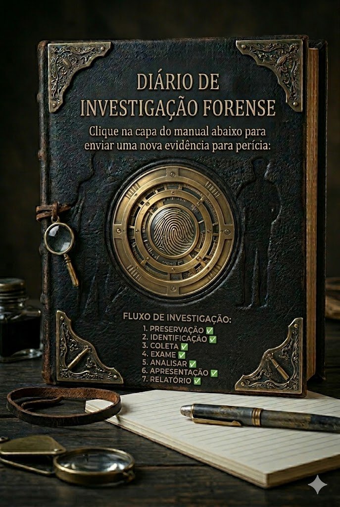

# My-Security-Journey
Bem-vindo(a) ao meu diário de bordo!
Aqui documento tudo o que aprendo enquanto me torno uma especialista em CyberSecurity😎

💡**Aviso** Este repositório é focado em estudos pessoais.Nunca use as as informações daqui contra sites reais na internet sem autorização. Utilize ambientes de treino locais ou plataformas gratuitas de treino.
>"Sinta-se à vontade para fuxicar,acompanhar minha evolução e se desejar contribuir com assuntos, questionamentos, pode inclusive abrir Issues."

---

## 📖 Livro de Visitas & Sugestões 🛡️

Tem uma dúvida técnica ou quer sugerir um tema para eu desbravar? 

**Clique no livro abaixo!**

---

